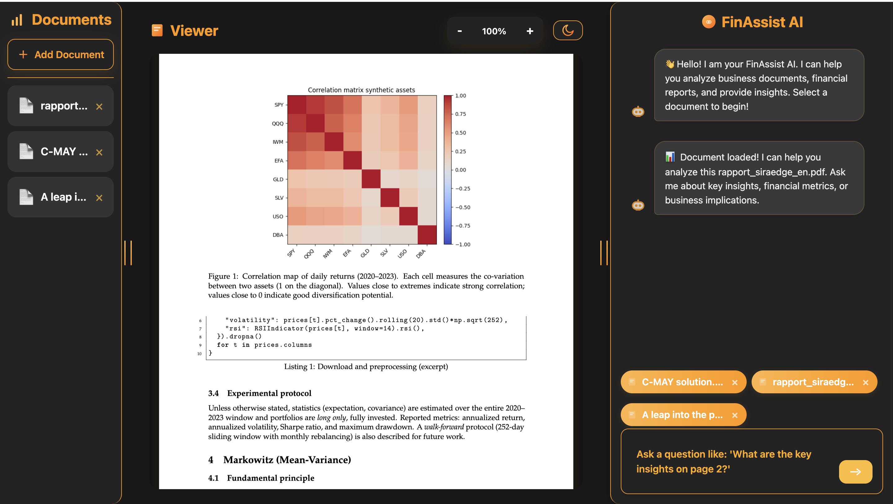

# FinAssist Copilot

FinAssist Copilot is a dark-themed assistant that helps analysts browse financial PDFs, extract text or images, and query an AI copilot that understands the uploaded content. The repository bundles both the interactive front-end experience and the supporting Python services responsible for OCR, PDF processing, and image understanding.



## Key Features

- Document sidebar with instant navigation across bundled or user-provided PDFs.
- Real PDF rendering via PDF.js with smooth scrolling and selectable text layers.
- Embedded conversational assistant that can answer finance-focused questions about the active document.
- Vision pipeline capable of describing charts, tables, and general images detected in each PDF.
- Responsive Surseoir design system with 3D cards, subtle motion, and consistent typography.

## Architecture Overview

- **Frontend**: static assets in `static/` combining HTML, Tailwind CSS (via CDN), vanilla JavaScript, and PDF.js.
- **Backend**: Flask application in `app.py` with supporting utilities under `utils/` for OCR, PDF parsing, and image analysis.
- **Vision services**: `utils/vision.py` orchestrates OpenRouter calls, caching, and error handling for chart/table understanding.
- **Persistence**: IndexedDB helper (`static/src/js/idb.js`) keeps uploaded PDFs available offline.
- **Tests**: `test_vision.py` and `test_vision_api.py` validate the computer-vision workflow and API surface.

Detailed explanations for each module live inside the `documentation/` directory. Start with `documentation/README.md` for the table of contents.

## Installation and Usage

### 1. Serve the Frontend
```bash
# Option A: open the static page directly
open static/index.html

# Option B: run a lightweight server
python -m http.server 8000 -d static
# or
npx http-server static
```
Navigate to `http://localhost:8000` after the server starts.

### 2. Run the Flask API (optional, for OCR/Vision endpoints)
```bash
pip install -r requirements.txt
cp .env.example .env   # fill in OPENROUTER_API_KEY before running
python app.py
# or
flask run --host=0.0.0.0 --port=5002
```

### 3. Add Your Own PDFs
1. Place the files under `static/`.
2. Update the document list in `static/src/js/app.js`.
3. Reload the page to refresh the sidebar.

## Project Structure

```
FinAssist/
├── app.py                     # Flask entry point
├── documentation/             # Technical documentation set
├── static/
│   ├── index.html             # Main interface
│   └── src/
│       ├── css/
│       │   └── app.css
│       └── js/
│           ├── app.js
│           ├── idb.js
│           └── landing.js
├── utils/
│   ├── ocr.py
│   ├── pdf.py
│   └── vision.py
├── requirements.txt
├── runtime.txt
├── Procfile
└── README.md
```

## Technology Stack

- **Frontend**: HTML5, Tailwind CSS (CDN), vanilla JavaScript, PDF.js rendering.
- **Backend**: Python 3.12, Flask, gunicorn (for deployment), python-dotenv.
- **Document Processing**: PyPDF2 for text extraction, pytesseract + Pillow for OCR, OpenCV + NumPy for chart/table heuristics.
- **AI Integration**: OpenRouter-hosted models for language and vision reasoning with caching handled by `vision_cache.json`.
- **Storage**: Browser-side IndexedDB for offline PDFs; optional backend persistence via Flask extensions.

For deeper dives into each layer—OCR, PDF extraction, IndexedDB storage, CSS system, deployment, and the production roadmap—refer to the dedicated files inside `documentation/`.

## Configuration & Secrets

- Duplicate `.env.example` to `.env` and set the variables:
  - `OPENROUTER_API_KEY`: API key used for LLM and vision requests (never commit the real key).
  - `FLASK_ENV`: `development` by default; set to `production` in hosted environments.
  - `PORT`: Listening port for the Flask server (defaults to `5002`).
  - `MAX_TOKENS_PER_REQUEST` (optional): override the tiny demo rate limit enforced by `/ask`.
  - `RATE_LIMIT_CONTACT` (optional): email displayed in the UI when the rate limit triggers.
  - `MAX_REQUESTS_PER_WINDOW` (optional): number of `/ask` calls allowed per `REQUEST_WINDOW_SECONDS`.
  - `REQUEST_WINDOW_SECONDS` (optional): duration of the sliding window for request rate limiting.
- Ensure `.env` remains untracked (already covered by `.gitignore`) before publishing the repository publicly.
- Rotate and revoke any keys that have been previously shared to avoid accidental exposure.

## Troubleshooting

- **PDFs do not render**: confirm the files exist under `static/`, the HTTP server has access, and the browser console does not show PDF.js errors.
- **Chat panel remains inactive**: ensure `static/src/js/app.js` is loaded and the Flask API (when used) returns a 200 response.
- **Vision requests time out**: review `vision_cache.json`, check network access to OpenRouter, and verify the `OPENROUTER_API_KEY` value.


